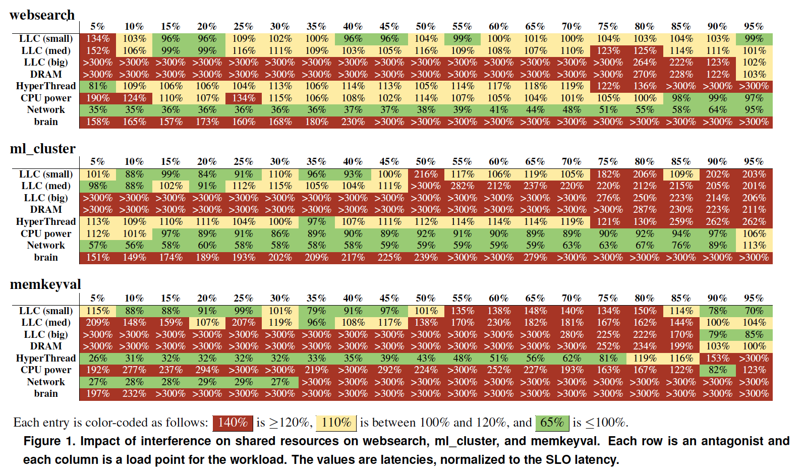
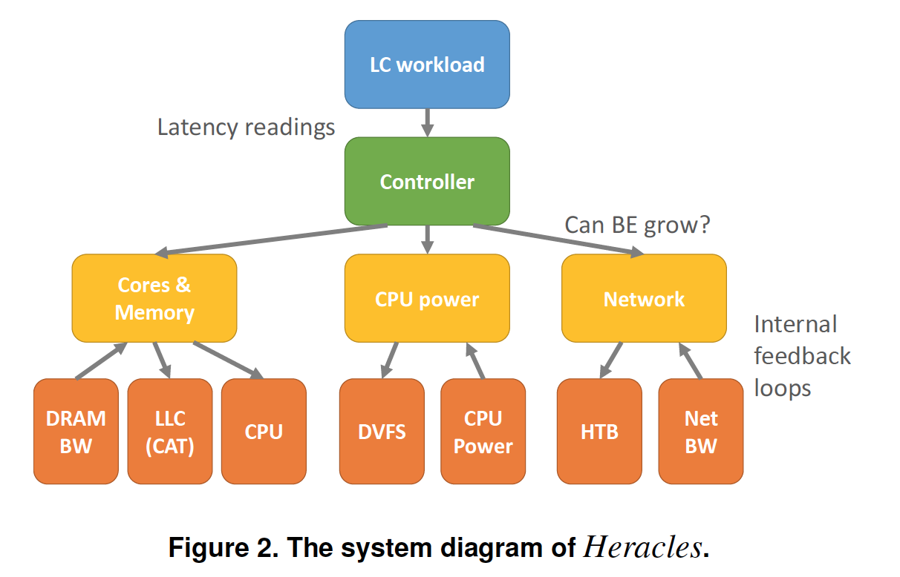
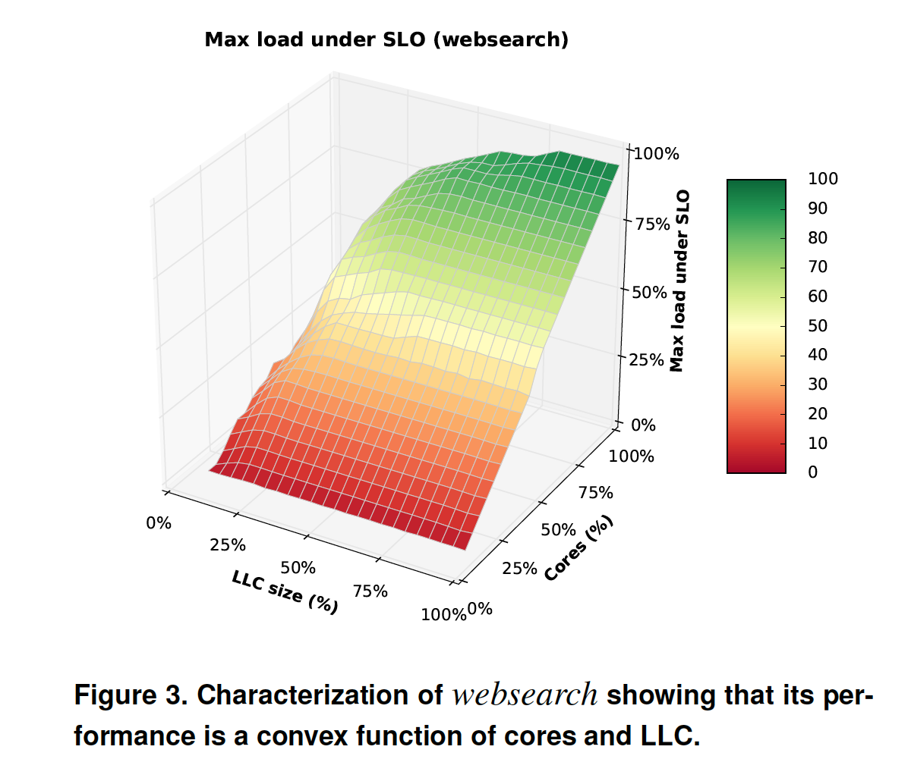
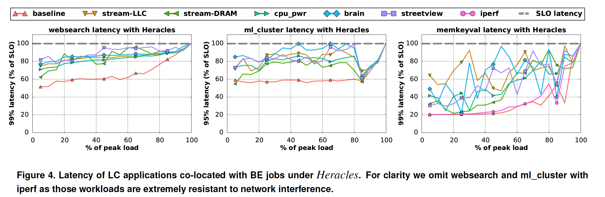
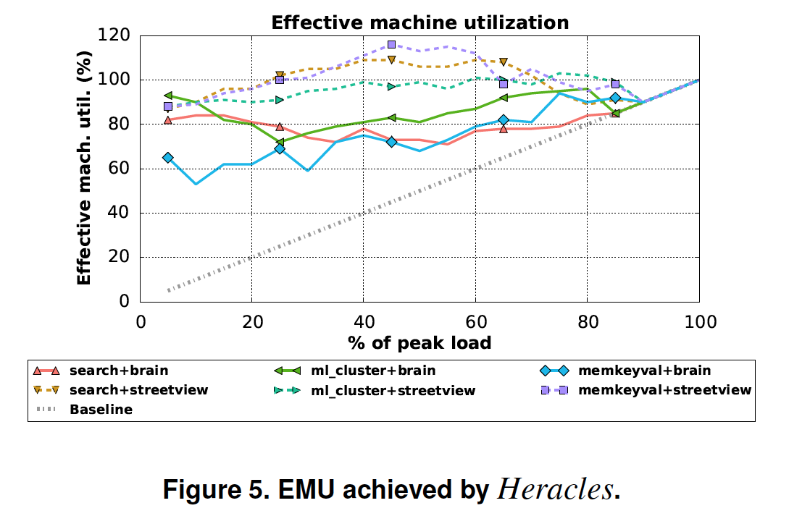
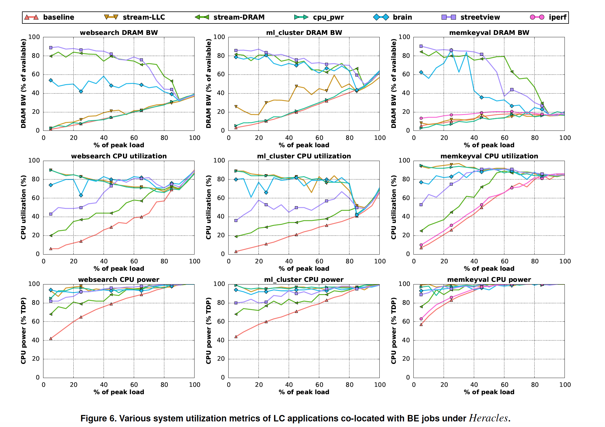
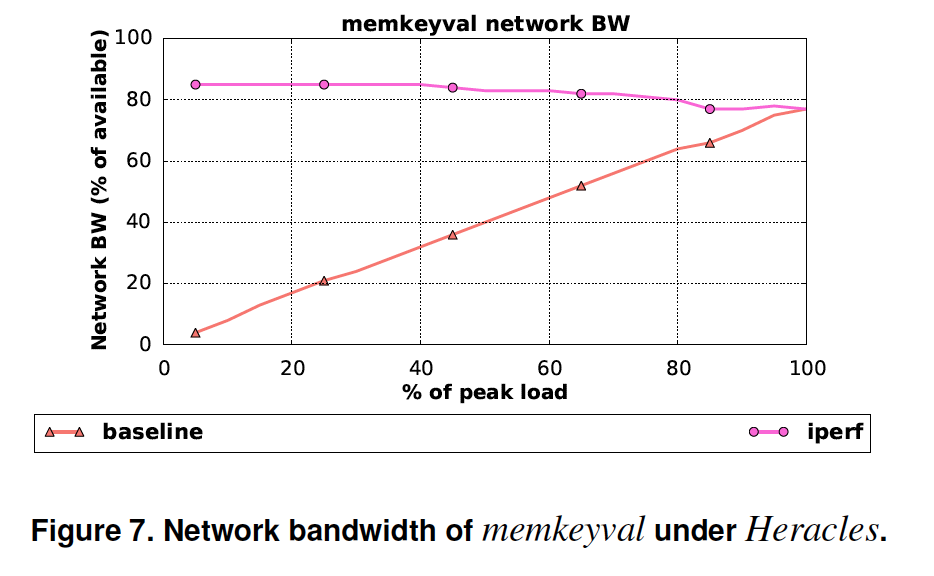
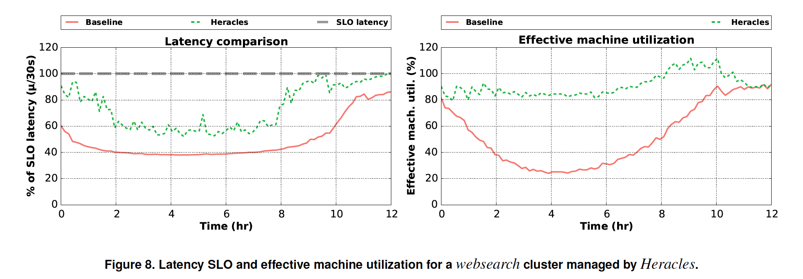

# Heracles: Improving Resource Efficiency at Scale

### 摘要

类似于 *websearch* 这种面向用户、延迟敏感的服务, 在日常低流量的情况的下未能充分的利用计算资源，很少在生产性服务商为其他的任务重新利用这些资源，因为争夺共享资源会让延迟导致毛刺，以致违背了延迟敏感敏感任务的 *SLO* (service-level objectives)，这个利用率不足的损伤了大规模化数据中心的承受能力和能源效率，随着技术规模的缩小，寻找这个机会变得非常重要。

我们提供了Heracles，它是一个自反馈的控制器，能够尽力执行任务的安全托管并伴随延迟关键性任务，Heracles动态的管理多个硬件和软件隔离机制，比如cpu,内存和网络隔离，以确保延迟敏感任务满足延迟目标同时提供最大化的资源给尽力执行的任务。我们评估Heracles使用的来自谷歌生产线上延迟关键性任务和批量任务并且证明了在所有负载和混部场景下平均服务器利用率90%的情况下没有违背延迟目标，

### 介绍

公有云和私有云框架允许我们持续增长成千上万台服务器的大型数据中心的负载数量，云服务的商业模式强调降低基础架构成本,现代的节能数据中心的总体拥有成本(TCO),服务器有大量的(50%-70%),因而需要继续扩大服务器的最大化利用率

直到最近，摩尔定律为每一代服务器规模化的提供了每美元更高的计算能力，允许数据中规模化但不增加更多的花费。但是在技术规模上有一些迫在眉睫的挑战，交替方法是需要的。一些方法通过平衡设计或者有效成本组件来寻找减少服务器成本。一个正交的方式是去改善投资回报和提高服务器的利用率来增加数据中心的效率，低的利用率既会对运营也会对成本效率的资本成本产生不利的影响，能量相对性能在低利用率的情况下降低运营费用。但是为了摊还更大的资本费用，增加有效的服务资源是必要的

大量的研究表明平均服务器的利用率在多数数据中心是很低的，范围在10%-50%，资源利用率低的一个主要原因是普遍的延迟敏感(LC)服务如社交媒体,搜索引擎,saas(software-as-a-service),在线地图，网络邮箱，机器翻译，在线购物和广告。这些面向用户的服务通畅规模在上千台服务器并且访问跨服务器间分布式状态的存储在内存或者Flash的数据，当他们由于昼夜模式和用户入侵导致的不可预知的波峰时负载明显变化，它能难去考虑在高利用率服务器子集下固定负载，因为服务器的状态不能够填充一个小数量的服务和迁移状态时昂贵的。这种利用率不足导致的代价是很重要的，例如，谷歌的websearch服务经常在24小时期间平均空闲超过30%，假设一个集群规模是10000台服务器，这个空闲转化成一个浪费了3000台服务器的容量。

一种有用的方式去提高效率是运行尽力服务的批处理(BE)任务在相同的服务器上并且开拓任何LC任务不利用的剩余资源，批量解析框架能够生成很多BE任务和得到重要的数值即使任务偶尔被延迟或者重启。这个方法主要的挑战是混部任务在共享资源上的干扰，比如缓存，内存，I/O管道，和网络连接。LC任务需要在尾延迟上严格满足SLO，并且即是小数量的干扰能导致严重的违背SLO，因此，过去一些对任务的工作仅仅集中于吞吐量任务。更多最近的系统预测或者发现宕LC任务受到混部任务严重的干扰时会避免或者终止混部。这些系统保护LC任务，但是减少了通过混部得来的高利用率的机会

最近引进缓存隔离的硬件特性和细粒度能耗控制允许我们去改善混部，这个工作的目标是能够对LC任务进行侵入式的混部并且在现在的服务器上BE任务能被自动的协调多个硬件和软件隔离机制。共享缓存分区和细粒度能耗/频率设置，以及两个软件机制，核心／线程调度和网络流量控制。我们的目标是对LC任务在所有级别的负载下消除违背SLO，同时最大化BE任务的吞吐量。

朝着这个目标走会有很多的挑战，首先，我们必须仔细共享各种独立的资源；保守分配将会导致BE任务小的吞吐量，当乐观分配将会导致LC任务违背SLO。第二，两个类型任务的性能依赖于多个资源，会导致一个大的分配空间以至于必须实时的随着负载变化而探索，最后，在现代服务器上隔离资源和不隔离资源会有不明显的相互作用。例如，为LC任务增加在缓存的分配会避免热数据的驱逐可能会由于BE任务增加热数据的在缓存中丢失而导致内存带宽的干扰。

我们提供了Heracles，一个实时的，动态控制管理四种硬件和软件隔离机制用于协调一致的方式来维持LC任务的SLO，相比于现有系统，会防止干扰任务的混部，Heracles能够使得LC任务与任何BE任务混部，他保证LC任务接受刚刚足够多的每种共享资源去满足他的SLO，从而最大化BE任务的利用率。使用在线监控和一些LC任务的离线分析信息，Heracles识别当共享资源变的饱和以及可能会导致违背SLO时通过配置恰当的隔离机制去主动放着这些情况的发生

这项工作具体的贡献如下.首先，我们用生产线上的一些工程来描述了在共享资源干扰方面的影响。google的延迟敏感任务，包括websearch，在线机器学习集群算法，和一个在内存中的键值存储。我们展示干扰的影响是不均匀的和任务依赖的，从而排除了在一个服务器上静态资源分区的可能性。接下来，我们设计Heracles并表明:a)多个隔离机制的协调管理是在没有违反SLO的情况下实现高利用率的关键；b)仔细将干扰分离为独立子问题是有效的降低动态控制问题的复杂性;c)一个本地的，实时的控制器去监控每个服务器的延迟就足够了。我们评估Heracles在谷歌的生产服务器上，通过是他来混部生产上的LC和BE任务。我们展示了Heracles实现了一个在所有混部组合中平均90%有效的机器利用率和LC任务的负载满足SLO延迟，Heracles也将吞吐量/TCO从15%提高到300%，依赖于最初的数据中心平均利用率。最后我们建立了需要硬件机制来监控和隔离内存带宽，这个会提高Heracles的精确性和消除对离线信息的需要。

据我们所知，这是第一个研究去协调使用新的和现存的隔离机制的实时控制器去证明为生产系统上运行LC任务效率方面重要的改善


### 共享资源的干扰

当两个或者多个工作负载同时在一台服务器上执行的时候，它们会竞争共享资源，这个章节我们回顾下主要的干扰源、可用的隔离机制和动态管理的动机

在一台服务器上最主要的共享资源是在一个或者多个cpu卡槽上的核心，我们不能简单的使用cgroups cpuset机制静态绑定核心给LC服务和BE任务混布的场景，当类似搜索这种面向用户的服务会出现负载毛刺，它们需要所有可用的核区面对吞吐的需求而不是导致违背SLO，同样我们不能简单的分配高优先级给LC服务和依靠操作系统的调度任务对核心的分配，通常的调度算法如linux的CFS算法，有漏洞，当LC服务和BE任务混布的时候以至于频繁的导致LC服务违背SLO，实时调度算法(eg:FIFO),会工作不饱和导致很低的利用率，
在英特尔核心上可用的超线程技术导致进一步的并发症，例如超线程执行BE任务能干扰LC超线程指令带宽、共享L1和L2级缓存，和TLBs

大量研究表明，在共享资源中的不可控的最后一级缓存干扰(LLC)对混部是有很大影响的。为了解决这个问题，英特尔最近介绍在服务器芯片上LLC缓存分区，这个功能叫做缓存分配技术(CAT),

1. 内存带宽


	大部分LC服务都是操作着很大的数据集，这个导致不能够CPU的CACHE是存放不下的,因而，在高负载的时候频繁的访问内存，使得内存带宽压力增大，以致于会对内存带宽比较敏感，尽管有了很多对内存带宽隔离上面的重要研究，但在商用芯片上还没有硬件隔离机制，在一些多socket服务器上，可以通过NUMA管道隔离不同的工作负载，但这种方法约束了内存的容量分配和寻址，内存带宽缺乏硬件支持，导致工作负载动态管理隔离复杂并且效率约束
	
2. 网络带宽

	数据中心负载扩展了应用增加网络流量，很多数据中心采用丰富的拓扑结构来均分网络流量来避免网络汇中路由拥塞现象，这里有多种网络协议，用来优先处理LC服务的短消息再处理BE任务的大消息，在一个服务器内，拥塞问题可能发生在网络入口也可能发生在网络出口，当一个BE任务导致网络拥塞，我们可以调整cpu核心的分配直到网络限流机制触发，在流量出口方向，我们可以用linux操作系统的交通管控(Traffic control)机制来提供对LC服务的网络带宽的保证，使得它们的信息优先于BE任务的信息，网络带块的交通管控必须能够随着系统负载被动态管理，另外静态网络流量优先级，可能会导致资源利用率不高甚至出现饿死现象
	
3. 能耗(power)
	
	在混部场景下,能耗是一个额外的干扰源，所有现代的多核芯片都有一些形式上的动态超频，比如英特尔芯片中的Turbo Boost以及AMD芯片中的Turbo Core，在能耗有余量的情况下这些技术提升了处理器芯片比标称频率的更高的频率，因而，LC任务使用的核心的时钟频率不仅仅取决于它自己的负载而且取决于运行在相同槽位上面的BE任务的强度，换句话说，LC任务可能会因为混部任务导致性能频繁的意外下降，这个干扰可以通过每个核心的动态电压频率缩放来减少( This interference can be mitigated with per-core dynamic voltage frequency scaling)，做为运行BE任务的核可以降低它们的频率使得LC任务保持正常的频率，静态策略会以最低的频率运行所有的BE任务从而确保LC任务没有能耗方面的限制，但是这个方法严重的惩罚了绝大部分的BE任务，大部分BE任务没有配置
	
4. 跨资源干扰
	
	混部的一个严重的挑战是跨资源干扰，一个BE任务可能会引发上面讨论过的所有共享资源的干扰，类似的，很多LC服务都会对多种资源干扰敏感，因而不能能够只去管理一种干扰资源，所有潜在的资源需要被监控和小心的隔离，另外干扰源是彼此互相交互的，例如，LLC的争夺可能会导致两种类型的任务都去需要更多的内存带宽从而可能导致瓶颈，类似的，一个任务注意到了网络拥塞问题从而企图使用数据压缩的方式可能会导致cpu和功耗方面的争夺，理论上，干扰可能的数量会是干扰源数据的平方，导致这成了一个非常困难的问题
	
### 干扰表征和分析	

本章节描述共享资源对延迟敏感服务的干扰特点

1. 延迟敏感的工作负载

	我们使用三个谷歌线上的延迟敏感的服务做为介绍，websearch 是线上web搜索服务中的一个查询服务部分，他是一个有一定规模的工程，通过大型的fan-out架构，提供了严格的延迟SLO且很高的吞吐量，拥有上千个用于查询搜索索引分片的子节点，对于这些叶子节点的SLO 99%的延迟在几十毫秒，websearch 负载的增加使用的是真实的用户查询中的匿名的追踪
	
	websearch 因为会存储很多的索引分片在内存中，因而有很高的内存使用，同时它还有适度的内存带宽需求，在负载100%的时候会占用40%的可用内存带宽，有很大一部分的索引侵入丢失在LLC上，这里有一个小但是重要的指令工作集和数据集在LLC中，它需要计算得分和排序搜索的hits从而有一定的cpu计算，，但是它不需要很大数量的网络带宽，为了这个研究，为了能够混部BE任务，我们使用较小份的内存在搜索服务上

	ml_cluster是一个独立的服务，用机器学习的技术来做实时集群文本分析，很多谷歌应用服务使用ml_cluster给集群分配文本信息的特征/片段，ml_cluster通过以前的离线训练模型把文本存放在集群中，这个模型因为性能的考虑主要存放在内存中，ml_cluster的SLO是 95%的延迟保证在几十毫秒，ml_cluster 采用的是捕获生产服务中真实的匿名请求追踪
	
	对比于websearch, ml_cluster需要更多的内存带宽(在峰值的时候需要60%的内存带宽)，但是只需要很少的cpu计算(整体来看cpu的能耗也是很低的)，同时对网络带宽的需求也是很低的，ml_cluster一个有趣的现象是它的每个请求都有少量的缓存足迹，但是存在很多重要的请求，就会转化成为一个很大数量的缓存压力，从而蔓延到对内存的压力，这个反应到我门的分析中是内存带宽随着负载是一个超线性的增长关系
	
	memkeyval 是一个内存中的key-value的存储服务，类似于 memchached，memkeyval被用于很多谷歌的后端web服务的缓存系统，其他的大型web服务公司如facebook和twiter广泛采用的是memcached，memkeyval明显的减少了每个请求处理耗时，对比于websearch,在峰值需要每秒几十万的请求指令导致它需要极高的吞吐量，因而任何请求的处理耗时必须很快，这SLO 是时延非常的低，99%的延迟在百来微秒的时延，memkeyval负载的增加方式跟ml_cluster一样
	
	在负载峰值，memkeyval会被网络带宽限制，尽管每个请求采用的是很小数量的网络协议，在高的请求率下导致memkeyval成为cpu密集型计算，相比之下，内存带宽的需求要比较小(在最大负载的时候使用20%的内存带宽)，request请求从内存中简单的接受value并且放入response中发送给网络，memkeyval既有对LLC静态工作集指令也有每个请求数据集
	
2. 表征方法

	为了了解这些服务对共享资源干扰的敏感性，我们运行上面的三个LC服务用一个合成的基线来衡量在每个隔离的资源下，虽然这些事在一个单独的服务节点下面的实验，不过这里可以远端控制负载的增长所以仍然会有大量的网络流量，我们为每个LC任务在多个不同的负载点下重复多个表征并且记录托管情况下尾延迟的影响
	
	使用的是google生产环境下的服务器，规格为:
	
	* 双叉槽, Intel Xeons based on the Haswell architecture
	* 每个物理cpu有比较多的核心
	* 每个核心的标称频率是2.3GHz and 2.5MB of LLC
	* 芯片有硬件支撑用于对LLC做分区(英特尔的CAT)
	
	我们进行如下的表征实验:
	
	* 核心
	
		正如我们在$2中的讨论，我们不能让LC和BE任务共享同一个逻辑核心(独立的超线程)，这会让操作系统调度引入几十毫秒的延迟毛刺，因此我们聚焦于使用不同的超线程的能力去运行在相同的物理核上，我们描述的实现时对LC任务共同定位超线程的影响，这个实验捕获超线程干扰的影响下限，更多的计算和内存使用微基准将会为多核资源对抗着LC超线程(eg:执行单元)和L1，L2缓存空间，因此如果这个实现表现出尾延迟很高的影响，我们可以得出通过超线程共享核心不是一个实际的选择的结论
			
	* LLC
		
		这个实验来测试LLC的干扰者对其的干扰，在特定的负载下给LC任务绑定足够的核心用于满足它的SLO并且绑定在同一个CPU插槽上面的剩余核心的干扰者传输着大量的数组阵列，我们使用数组阵列大小分别为占据LLC四分之一，一半和几乎所有的LLC的阵列，这些配置表现为LLC(small),LLC(med),LLC(big)
	
	* 内存带宽

		内存带宽的干扰方式跟LLC的干扰方式比较相似，使用明显非常大的数组阵列进行流式传输，我们使用numactl确保内存干扰者和LC任务分配到相同的一个或者多个CPU槽位并且所有的内存通道都会受到压力
		
	* 网络带宽流量

		我们使用iperf，一种开源TCP流式传输基准,使外出的网络流量饱和，除了一个核心以外的所有内核都提供给LC任务，因而我们考虑从多个客户端连接到LC服务，我们产生干扰以许多低带宽“小鼠”流的形式，增加网络流量的干扰也可以使用少许“大象”流，但是这些流会被TCP拥塞控制有效的节流，而LC很多的“小鼠”流不会受到影响
		
	* 能耗

		为了表征一个能耗干扰者对延迟的影响，相同的核心划分用来作为增加对LLC和内存带宽的干扰，而不是运行一个内存侵入干扰者，使用的是一个cpu能耗病毒程序，该程序设计为灰给所有的核心压力，导致高的能耗导致降低cpu的核心频率
		
	* 操作系统隔离
	
		为了完整性，我们运行BE任务和LC任务仅仅使用操作系统可用的隔离机制来评估整体的影响，我分别用linux的容器技术运行两个工作任务并且设置BE任务是一种低的优先级运行，这种调度策略通过CFS使用共享参数，相比于LC任务，BE任务接受很少量的共享资源，没有任何资源隔离的机制就是使用这种方式，BE任务使用的是goole的brain程序，我们会在将来在继续讨论
		
3. 干扰分析

	
	
	图一三种LC负载的尾延迟表现出干扰微基线的影响，在表中每一行展示的是在某种负载下LC任务和混部微基准下的尾延迟情况，只有在尾延迟小于SLO的100%的情况下这些干扰的影响才能够被接受，我们使用全彩色的代码来标示时延，用红/黄来标示违反了SLO延迟
	
	通过brain程序的运行的那行记录，我们理解注意到当前的操作系统的隔离机制是不足以让LC和BE进行混部的，即使在低负载的情况下，BE任务在共享资源上创造足够的压力会导致这三种LC任务的SLO被违背，很大的贡献在于操作系统允许两个任务运行在相同的核心上和运行在相同的超线程上，进一步加重了干扰，尾延迟最后超过了SLO的300%，建议干扰管制的集群管理，比如Paragon和Bubble-Up，讲不会允许这种情况混部，为了能够暴力的达成这种任务混部，我们不仅仅需要做到不允许不同的任务运行在相同的核心或者超线程上，我们还需要更强的隔离机制
	
	LC任务会因为个别共享资源的变化而被干扰的敏感性，例如，memkeyval对网络干扰相当的敏感，但websearch 和 ml_cluster基本没有受到影响，websearch对LLC(small)和LLC(med)的干扰均不敏感，但不能说对memkeyval 和 ml_cluster也如此，另外负载的改变干扰的影响，ml_cluster在负载小于50%的时候能够容忍LLC(med)的干扰，但是在高负载的时候会有很严重的影响，这些观察促动需要隔离机制动态的管理，以适应不同的负载变化和不同的任务，任何静态的策略都会太保守(遗失混部的机会)或者过于乐观(导致违背任务的SLO)
	
	我们现在分别讨论每个LC任务，为了去了解他们对特殊资源的需求
	
	* websearch

		这个任务会有少量的对CPU缓存的足迹，并且LLC(small)和LLC(med)干扰不会影响到尾延迟。然而，对于LLC(big)的干扰会有很严重的影响，这种退化是由于两个因素导致的，第一个，在这种特别的芯片中LLC的包容性在高的LLC干扰下会导致丢失指令工作集，第二个，争夺LLC也会严重的导致内存带宽压力，websearch对于饱和的内存带宽干扰会特别的敏感。在websearch的负载增加的时，LLC和内存带宽的干扰会下降，在高的负载时候，websearch使用更多的核心同时干扰器会给更少的核心，因此websearch能够更好的保护它的共享资源。
		
		websearch直到高负载的时候都能够适应超线程的干扰，这表明核心直到80%的负载之前对spinloop和websearch有足够的指令发布带宽，由于spinloop仅仅侵入寄存器，它不会对L1和L2缓存产生干扰，但是由于超线程干扰者有最小可能性的影响，更多的干扰器会导致更大的性能问题，因此超线程的干扰在实践中需要被避免，随着更多的核心执行能耗病毒会使得websearch较低利用率的时候使得能耗干扰有一个重要的干扰，如预期的，由于websearch对带宽的低需求导致网络干扰器不会影响到websearch
		
	* ml_cluster

		ml_cluster对于LLC(small)干扰敏感大小，由于每个请求工作集小但是重要，这个体现在LLC(small)70%负载和LLC(med)50%负载的时候它会有一个很大的跳跃，在LLC(big)的干扰下ml_cluster主要延迟严重退化，ml_cluster也会对内存带宽的干扰敏感，ml_cluster直到高负载之前对于主要在低的负载(见websearch的解释)情况下适应超线程的干扰，表明它在高的负载时仅仅达到高的指令发布率，ml_cluster对于能耗的干扰只有较小的影响，因为对比于websearch cpu计算密集程度更小，最后，ml_cluster根本不受网络干扰的影响。
		
	* memkeyval

		由于明显的更严格延迟SLO，memkeyval对所有类型的干扰都会敏感，在高负载的时候，memkeyval在小的工作集加起来会对LLC(small)敏感，在面对LLC(med)的干扰时出现了两次延迟峰值，对此峰值在小的负载时从缓存中干扰器移除指令引发的，当memkeyval在高负载的时候获得足够的核心，他避免了这些驱逐，第二个峰值时在高的负载的时候，当干扰起干扰每个请求工作集，在高水准的LLC干扰下，memkeyval不能够达到SLO，尽管memkeyval只有很低的内存带宽需求，但是他对内存带宽干扰有很大的影响，讽刺的是，少数来自memkeyval的内存请求被内存干扰器覆盖
		
		除了高负载之下，memkeyval对超线程干扰器不敏感，相比之下，它是计算密集对能耗干扰非常敏感，memkeyval会消耗大量的网络带宽，因此对于竞争网络流量会有很高的敏感性，即使在小的负载时候，他完全被大量的小的("小鼠")干扰流量超限并无法满足SLO
	
4. Heracles的设计

	我们确认了对混部中对共享资源的动态管理控制，超越操作系统级别调度的隔离机制需求，herales是一个动态的，自反馈的，实时的控制器用于通过硬件和软件机制管理在混部中隔离，heracles实现了iso-latency策略，他能够在满足SLO时增加资源的利用率，这个策略通过容忍某些混部导致的干扰来允许增加服务的利用率，只要LC任务的SLO延迟目标和实际延迟(延迟松弛)的差异是积极的，在当前的版本中，heracles管理的是一个LC任务和多个BE任务的混部，因而BE任务是丰富的，这足以提高很多数据中心的利用率，我们会在将来实现多个LC任务混部的。
	
	1. 隔离机制

		heracles通过四种机制来减轻干扰
		
		* 核心隔离
			
			heracles使用linux的cpuset cgroups 来绑定LC任务在一些核心上同时绑定BE任务在另外的一些核心上(软件机制),这种机制是必须的，因为在$3中我们展示过共享核心会对SLO的延迟有损，此外，随着每个服务器的核心数量的增加，导致核心隔离需要更加细粒度，分配核心给任务需要动态的去完成，linux能迁移任务去其他核心的速度限制了分配速度，通常需要几十毫秒
			
		* LLC隔离

			heracles使用了最近的Intel芯片中的CAT技术来隔离LLC(硬件机制)，CAT采用对共享LLC的分区方式，在一个高度关联的LLC中，它允许我们定义非重叠的百分之几细粒度的LLC总容量的占用，我们给LC任务一个分区以及所有其他的BE任务分到第二个分区，	分区大小能够通过编程模型指定给寄存器(MSRs)动态的调整,任务的更改在几毫秒内生效，
		
		* 内存带宽隔离

			现在没有商业可用的带宽隔离机制，我们通过下面的方法执行内存带宽的限制，我们实现软件监控，定期的通过性能计数器追踪总的带宽并且估算LC和BE任务对内存带宽的使用，如果LC任务没有获得最够的带宽，heracles会调控减少对BE任务对核心的使用数量，我们会在$4.2中讨论这种粗粒度限制方法
			
		* 能耗隔离

			heracles采用对cpu频率监控，运行平均能耗限制(RAPL)和每个核心的DVFS(硬件特性),RAPL用于监控每个cpu槽位的cpu能耗，而每个核心的DVFS被用来重新分配给每个核心能耗，每核心DVFS设置更改在几毫秒内生效。频率步骤在100MHz并跨越处理器的整个操作频率范围，包括Turbo Boost的频率
			
		* 网络流量隔离

			heracles使用linux的流量控制(软件机制)，具体我们使用的是分层令牌桶队列训练(HTB)的qdisc调度策略来执行对BE任务出口流量的带宽限制，这个带宽限制用来设置对BE任务最大流量的突发速率的限制(HTB中的说法是ceil参数)，这上面没有对LC任务有任何的限制，HTB能欧更新的非常的频繁，并且新的带宽限制能够在几百毫秒内生效，管理入侵网络干扰已经多次在前面的工作中检查过了，超出了这项工作的范围。
			
	2. 	设计架构

		任何硬件和软件隔离机制允许合理精确的控制每个资源，鉴于这些，控制器必须动态的解决高维度的问题去找到为LC和BE混部的任务在任意负载下所有这些机制的正确的设置，heracles解决的是一个优化问题，他的目标是在满足SLO约束的情况下最大化资源利用率
		
		heracles通过解耦干扰源的方式来降低优化的复杂度，洞察降低干扰问题仅仅在一个共享资源变得饱和的时候，例如，资源利用率的提高直到延迟问题的发生，这个见解可以通过$3分析出来，干扰器不会导致严重违背SLO直到一个拐点，这个点导致尾延迟问题迅速极度恶化，因此如果heracles能欧放着任何共享资源变的饱和，那么他能够分解高纬度优化问题变成很多一维或者二维小的但独立的问题，然后每个子问题能够通过声音优化的方法去解决，比如梯度下降
		
		因此heracles必须确保LC任务的SLO目标被满足，持续不断的监控延迟和延迟松弛度并把这两个key做为输入进行决策，当延迟松弛度很大的时候，heracles认为它是一个安全的并且能够有更多的混部侵入的信号，然而如果延迟松弛度比较小的时候，heracles会回退避免SLO恶化。heracles也会监控负载(每秒的查询)和这个期间的高负载，他会由于要避免违背SLO的高风险而禁止混部，	之前的工作表明了间接的性能metrics指标，比如cpu的利用率不足以保证SLO。
		
		理论上，heracles会不需要除了SLO的目标外的其他离线信息，不幸的是，当前硬件的一个缺点导致这个很困难，我们使用的Intel的芯片不能欧提供精确的对在每个核心粒度上内存带宽的衡量(或者限制)机制，为了了解heracles是怎么决策影响内存带宽延迟敏感的使用和BE任务以及去管理带宽饱和，我们需要更多的离线信息，具体来说，Heracles使用离线模型来描述延迟敏感任务在各种负载、核心和LLC分配情况下对内存带宽的使用，我们验证了仅仅在项目架构重大变化的时候这个模型需要重新生成数据并且小的偏差是没问题的。没有必要对于BE任务的任何离线分析，相比于更好管理和理解的LC任务，BE任务有很大差异，也不需要离线分延迟敏感和正常任务的相互作用，一旦我们有了对每个核心内存带宽方面的硬件支持，我们会去掉这个离线模块
		
	3. heracles 控制器

		

		heracles运行一个独立的实例在每个服务器上，管理混部任务的本地交互，如图2所示，由三个子控制器组成(核心和内存控制器，cpu能耗控制器和网络流量控制器)被顶级控制器(top-level controller)协调,子控制器是相互对立运行的，确保各自的共享资源不饱和
		
		* 顶级控制器

			```
			1  	while True:
			2  		latency=PollLCAppLatency()
			3 		load=PollLCAppLoad()
			4 		slack=(target-latency)/target
			5 		if slack<0:
			6 			DisableBE()
			7 			EnterCooldown()
			8 		elif load>0.85:
			9 			DisableBE()
			10 		elif load<0.80:
			11 			EnableBE()
			12 		elif slack<0.10:
			13 			DisallowBEGrowth()
			14 			if slack<0.05:
			15				be_cores.Remove(be_cores.Size()-2)
			16 		sleep(15)
			
			Algorithm 1: High-level controller.
			```
			
			算法1展示了这个控制器的伪代码，这个控制器每15秒拉去LC任务的尾延迟和负载信息，这样就足够了查询统计有意义的尾延迟，如果在这个服务器上LC的负载超过它的峰值的85%，控制器会禁用BE任务的执行，这种经验性的保护用来避免在高利用率的系统上增加小量利用率带来的延迟管理的困难，对于滞后目的，BE任务的执行在负载低于80%的时候会被允许，LC任务的SLO目标和当前测量的尾延迟的差值为负时，延迟松弛度也可以导致BE任务执行被禁用，这通常发生在延迟敏感任务负载有毛刺的时候，我们对延迟临界上的任务在重新企图再次混部之前所有资源一个缓冲时间(eg:5分钟)，这个使用的参数是通过经验调整出来的
			
			当这两个保护措施没有激活的时候，顶级控制器通过slack去子控制器去提供资源给BE任务，如果slack小于10%，则指示子控制器禁止BE任务的增长，以保证一个安全的边缘，如果slack下降到了低于5%，则指示cpu核心子控制器从BE任务的中切换核心到LC任务，这回提高LC任务的延迟同事减少BE任务对任何资源的干扰能力，如果slack高于10%，则知识子控制器允许BE任务获得更大的共享系统资源，每个子控制器独立的分配资源决策，当资源使用不饱和时提供信息	
			
		* 核心和内存控制器	

			

			```
			1  	def PredictedTotalBW():
			2 		return LcBwModel()+BeBw()+bw_derivative
			3  	while True:
			4 		MeasureDRAMBw()
			5 		if total_bw>DRAM_LIMIT:
			6			overage=total_bw-DRAM_LIMIT
			7 			be_cores.Remove(overage/BeBwPerCore())
			8 			continue
			9 		if not CanGrowBE():
			10 			continue
			11 		if state==GROW_LLC:
			12 			if PredictedTotalBW()>DRAM_LIMIT:
			13 				state=GROW_CORES
			14 			else:
			15 				GrowCacheForBE()
			16				MeasureDRAMBw()
			17 				if bw_derivative>=0:
			18 					Rollback()
			19 					state=GROW_CORES
			20 				if not BeBenefit():
			21 					state=GROW_CORES
			22 		elif state==GROW_CORES:
			23 			needed=LcBwModel()+BeBw()+BeBwPerCore()
			24 			if needed>DRAM_LIMIT:
			25 				state=GROW_LLC
			26 			elif slack>0.10:
			27 				be_cores.Add(1)
			28 		sleep(2)

			Algorithm 2: Core & memory sub-controller.
			```

			由于多核、LLC需求和内存带宽需求的强耦合heracles使用独立的子控制用于核心和cache的分配，如果有一种直接的方式隔离内存带宽，我们会使用独立的控制器，算法2展示了这个控制器的伪代码，它输出是分配核心和LLC是给LC和BE任务。
			
			该子控制器的第一个约束是避免内存带宽饱和。 DRAM控制器提供寄存器追踪带宽使用情况，使其能够很容易的发现何时达到了内存带宽峰值流量的90%，通过这种方式，子控制器会移除BE任务更多的核心以避免达到饱和.Heracles通过LC任务需要的带宽模型和一组与每个核心内存流量到NUMA-local内存控制器成比例的硬件计数器集来估算每个BE任务的内存带宽的使用量，为了使后者的计数器有用，我们限制了每个BE任务到一个独立的槽位并使用linux的numactl来分配核心和内存，不同的BE作业可以运行在任何一个槽位并且LC任务能够跨越槽位获取核心和内存。
			
			当顶级控制器发BE任务增长信号并且这里内存带宽没有饱和，子控制器使用梯度下降去找到最大数量的核心和内存分区给BE任务，LC应用的离线分析(图片3)展示了他们的性能对和兴和内存资源是一个凸函数，从而保证梯度下降将找到全局最优，我们一次执行一个维度的梯度下降，切换着增加核心和增加LLC缓存给BE任务，最初，一个BE任务给予一个核心和10%的LLC并且进入GROW_LLC阶段，BE任务的LLC分配增加只要LC任务满足他的SLO、带宽避免饱和以及BE任务自己的效益。下一个阶段(GROW_CORE)	给BE任务增加cpu核心数量，Heracles将会重新从LC迁移给BE任务一次分配一个核心。每次都会检查内存带宽的饱和度和是否违背了LC任务的SLO。如果先发生带宽饱和，子控制器会返回GROW_LLC阶段，这个过程会重复执行直到收敛到一个最佳配置。这个搜索也会犹豫顶层控制器对BE任务的资源增长或者禁止的指示信号而终止。
			
			在梯度下降期间，子控制器必须避免尝试次优解，这会触发内存带宽饱和或者来自顶层控制器来禁用BE任务，为了估算先前分配的内存带宽的使用量去尝试它，子控制器使用最近的LLC缓存和核心重新调配后的内存带宽的导数。Heracles基于一定数量的延迟松弛来估算是否接近LC任务的SLO的上限，
			
		* 能耗控制器 

			```
			1 	while True:
			2 		power=PollRAPL()
			3 		ls_freq=PollFrequency(ls_cores)
			4 		if power>0.90*TDP and ls_freq<guaranteed:
			5 			LowerFrequency(be_cores)
			6 		elif power<=0.90*TDP and ls_freq>=guaranteed:
			7 			IncreaseFrequency(be_cores)
			8 		sleep(2)
			
			Algorithm 3: CPU power sub-controller.
			```
			这是一个简单的子控制器可以用算法3来描述，确保有足够的能耗去在最低保护频率下运行LC任务，这个频率确定是采用当LC任务在满负载下独立运行下来衡量的频率，Heracles使用RAPL来确定实际CPU的能耗和它的最大设计能耗，或者热耗散功率(TDP),它还会对每个核心做cpu频率监控，当实际能耗接近TDP和运行LC任务的核心频率太低，他会使用每个核心的DVFS来降低运行BE任务核心频率，为的是转移能耗预算给运行LC任务的核心，为了避免LC任务进入主动空闲状态的混乱中必须满足这两个条件，这也倾向于低能耗读数，如果这里有足够的操作能耗余量，Heracles将会对BE任务的核心增加频率限制以最大化他们的性能，这个控制独立循环的为这两个槽位运行并且周期时间是两秒。
			
		* 网络控制器

			```
			1 	while True:
			2 		ls_bw=GetLCTxBandwidth()
			3 		be_bw=LINK_RATE-ls_bw-max(0.05*LINK_RATE,0.10*ls_bw)
			4 		SetBETxBandwidth(be_bw)
			5 		sleep(1)
			
			Algorithm 4: Network sub-controller.
			```
			
			这个子控制器防止网络传输带宽的饱和，可以用算法4来描述，他监控LC任务相关的总出口流量带宽(LCBandwidth)，并且设置其他流量总的带宽限制为LinkRate-LinkRate-max(0.05LinkRate,0.10LCBandwidth)，添加10%的当前LCBandwidth或者5%的LinkRate添加进LC任务的预留空间中，以处理毛刺，带宽限制的执行是通过linux内核的HTB qdiscs，这个控制每秒循环运行一次，他提供了足够的时间让带宽执行者去解决。
			

5. Heracles评估
	
	1. 方法论		

		我们评估Heracles采用了在$3中分析过的谷歌三种线上、延迟关键的任务。我们首先执行实验让Heracles运行在独立的服务器上，当我们在不同负载下运行LC任务的时候引入BE任务，然后我们在10台有websearch集群的服务器上使用Heracles，当BE任务也在运行的时候我们测量fan-out结构的端到端的延迟。在集群实验中，我们使用了负载追踪一天的数据信息，捕获日负载的变化，所有的这些情况，我们使用的是谷歌的线上服务。
		
		对于LC任务我们面临过SLO延迟，自此SLO定义了60秒以上的窗口期，我们报告的是在实验中看到的最坏情况下的延迟。对于生产上的批量任务，我们用Heracles计算批量任务的吞吐率和规范它为独立服务器运行批量任务的负载，然后我们定义了有效的机器利用率(EMU)=LC吞吐率+BE吞吐率，注意由于更好的对共享资源利用使得EMU可能会超过100%，我们也会报告共享资源的利用情况在必要的突出系统方面的细节时。
		
		BE任务我们选择于既包含线上批处理任务又包含主要针对单个共享资源的合成任务，这些具体的任务是:
			
		* stream-LLC 类似于$3.2中LLC(med)一样的流数据大小能够填充大概一般的LLC
		* stream-DRAM 流通过一个极大的数组，不能适合LLC(来自同一部分的DRAM),我们使用这些任务来验证Heracles能够最大限度的使用LLC分区并且避免内存网络饱和
		* cpu_pwr 是$3.2中的cpu能耗病毒，他的使用验证Heracles将会重新分配能耗以确保LC任务保持其需要的频率。
		* iperf 是一个开源网络流基准测试，验证Heracles是否正确的对网络传输带宽分区以保护LC工作量。
		* brain 是谷歌生产上的一个批量任务，对图片执行深度学习成为自动化标签，这是一个很强的cpu密集性任务，对LLC的大小敏感并且会有很高的网络带宽需求
		* streetview 是一个生产上的批量任务，为谷歌街景视图缝合多个图片为全景图形式，这个任务对DRAM子系统有很高的要求。

	2. 单节点实验结果

		

		* SLO延迟

			图4展示了三种LC任务和BE任务混部在Heracles控制下可能的负载的影响，注意到Heracles企图运行尽可能多的BE任务并且最大化他们接受到的资源，在混部中所有负载的情况，这里使用Heracles没有违背SLO，即使是brai任务也是正确的，这个任务即是在最好的操作系统隔离机制将使一些LC任务不可用，这个验证了控制器保持共享资源不会饱和以及在任何负载下分配足够的资源给LC任务，Heracles维持一个小的延迟松弛度做为保护带去避免毛刺和不稳定的控制。也验证了在尾延迟的本地资源是足够的，稳定的控制了应用毫秒级和微妙级的SLOs，有趣的是，websearch当生成内存带宽离线分析模型并且执行实验的时二进制和分片被改变。然而，Heracles对这些改变能弹性处理并且对一些过时的模型处理的很好。
			Heracles降低了在这个期间所有低利用率任务延迟松弛度。对于websearch和ml_cluster，这个松弛度从40%到20%减少了一半。对于memkeyval,这个减少更加戏剧性，从80%减少到了40%以下，这是因为对比于它的SLO延迟而言卸下memkeyval的延迟更小，memkeyval的尾延迟很高的方差是由于实际它的SLO在几百微妙，使它相比于其他的任务对干扰更敏感。
		
		* 服务的利用率

			

			图5展示了EMU在使用Heracles管理混部线上的LC和BE任务，在所有的情况下，我们实现了重要的EMU的增加。当两个(websearch 和 brain)cpu密集型任务和能耗大的任务结合,Heracles任然实现了至少75%EMU。当websearch结合内存带宽高要求的steetview，Heracles能够提取足够的资源使得websearch的负载在25%到70%之间时EMU超过100%，这是因为websearch和streetview有着互补的资源需求，这里websearch需要绑定更多的cpu计算而streeview需要绑定更多的内存带宽。EMU的结果对于ml_cluster和memkeyval也是同样的。通过动态管理多个隔离机制，Heracles有机会提高EMU，或则会缺失避免干扰的调度技术
		
		* 共享资源的利用率

			
			

			图6绘制了在Heracles控制下共享资源的利用率(核心，能耗和内存带宽)，对于memkeyval，图7绘制了我们测量了网络流量带宽.
			
			通过面板，Heracles能够分配正确的大小给BE任务避免内存带宽饱和。对于stream-LLC的BE任务，Heracles找到正确的LLC分区去减少所有任务的总内存带宽需求。对于ml_cluster,有大的LLC足迹，Heracles通过有效的衡量stream-LLC和ml_cluster的需求，使得总内存带宽轻微高于基线。对于有高的内存需求的BE任务(stream-DRAM,
streetview),Heracles仅仅允许他们执行在少量的核心上避免内存带宽饱和。这个映射到低的cpu使用率单高高的内存带宽。但是EMU任然很高，对于这些任务的关键资源是不需要计算而是需要内存带宽。
			
			查看能耗的使用率，Heracles允许重点改善能量效率，考虑20%负载的情况:EMU增加了一个很大的数量级，从20%增加到了60%-90%。但是cpu的能耗仅仅从60%增加到了80%。这个转化意味着2.3-3.4倍的能源效率增益，总体来看，在不违背LC任务的SLO前提在所有负载下LCHeracles在资源效率方面取得了显着的进步。
		
		3. websearch 集群实验结果

			我们也评估了Heracles在websearch小型集群的情况，以10台服务器做为全尺寸集群的代理来模拟。这个集群采用fan-out架构对于每个用户请求会扩散到all其他的服务器并且合并他们的结果。它的SLO延迟被定义在主请求节点平均延迟超过30秒，用u/30s来表示。这个服务的目标SLO延迟设置在没有混部任务的时候在集群中90%负载时为u/30s。Heracles运行每个节点在主节点延迟目标集99%分位满足SLO，我们使用Heracles去执行brain在一半的机器节点并且另一半执行streeview程序，Heracles在所有节点上使用websearch相同的内存带宽离线模型，尽管websearch每个节点有不同的分片，当websearch没有满负载并且有很高的其他混部任务潜在影响下我们捕获12小时日常模式下的匿名请求来产生负载
			
			
			
			* SLO延迟

				图8展示了SLO延迟在有Heracles和没有Heracles情况下12小时的追踪，Heracles产生了不违背SLO但减少了20%-30%的松弛，发现每个节点99%的尾延迟足够保证整体的SLO。我们相信我们能够将来通过引入一个中央控制器在根节点基于松弛度来动态设置每个节点的尾延迟目标用于更大的websearch集群中减少松弛，这将允许未来的Heracles版本能够通过管理松弛度的优势在更大的fan-out架构中使用。
			
			* 服务的利用率

				图8也展示了Heracles在极限情况下成功的转换了延迟松弛度为明显的增加EMU，在整个追踪中，Heracles混部了足够的BE任务在不违背SLO情况下保持平均90%并且最小80%的EMU，在这次追踪中websearch的负载变化在20%-90%
				
			* TCO
				
				为了估计总的拥有成本的影响，我们使用了Barroso等人的TCO计算。使用从每台低成本服务器数据中心作为案例研究的参数。这个模型假设2000美元的服务器有2.0的PUE和能耗峰值在500w并且电费为0.10美元/千瓦时。通过我们的计算，我们假设一个10000服务器的集群。悲观假设websearch集群每天都是高利用率的，平均负载在75%，Heracles的能力能够提升利用率到90%转化15%吞吐量/超过基线的TCO改善。这个改善包括花费在高的利用率上增加能耗消费。在相通的假设下，这个控制器重点在于为websearch提升能量比率将会实现吞吐量／大约3%的TCO收益
				
				如果我们假设一个LC集群利用达到20%的平均值，做为很多行业研究的建议，Heracles可以实现吞吐量/TCO提高306%,控制器集中能量比例将会实现小于7%的改善，Heracles的优势是由于他事实上能欧提升利用率从20%到90%并且只增加了小量的能量消费，仅仅表现为初始TCO的9%。只要有有用的BE任务可用，应该都要选择与LC任务混部来提高吞吐量／TCO，而不是使用现代的数据中心的降低能耗消费的服务器。同时也要注意到对吞吐量/TCO的改善是一个足够大以抵消保留其他每个服务器一小部分的内存或者BE任务的存储的成本。
	
	6. 相关工作

		* 隔离机制

			有一个重要的中左在于隔离共享LLC，包括基于软分区的替换策略，分区方式，和粒度精细化的分区。Tessellation为基于吞吐量的应用程序请求分区资源暴露了一个接口，大多数缓存分区方案基于一个有效的政策去优化集合吞吐量已经被评估。Heracles用于管理的是最近加入Intel的cpu中粗细粒度的分区方式，使用搜索一个正确大小来分配以避免违背SLO，我们期望当他们的fine-grained partitioning方案商业可用时Heracles将来能工作的更好
			
			lyer等人，探索广泛的服务质量(QoS)策略用于模拟隔离共享缓存和内存系统特性，他们集中吞吐量指标，比如IPC和MPI，并且不考虑关键性延迟或者其他的资源，如网络流量。Cook等人，评估基于吞吐量的应用程序的硬件缓存分区但没有考虑延迟关键性任务。Wu等人，比较了共享缓存在不同容量管理方案，提出了共享缓存的Ubik控制器，通过增强支持细粒度分区在负载转换时间和要求应用级别的改变通知运行时的负载变化来分配给延迟关键性任务。Heracles不需要去LC任务有任何的改变，而是依托与稳态的方式来管理缓存分区来缓慢的改变分区大小。
			
			这里有多个对内存控制器的隔离和Qos特性的建议，而我们的工作展示了延迟关键性人物对内存隔离的需求，这些特点不是商业可用的关注点，多个网络接口控制器实现了带宽的隔离和硬件方面的优先机制。不幸的是，这些特性不会被设备驱动程序暴露出来。因此，Heracles和相关的工程在网络优化隔离上当前使用的是linux的qdisc，支持网络隔离的硬件应该加强这方面的工作。
			我们评估的LC任务不会使用磁盘或者ssd是为了积极的达到他们的延迟目标。不过，磁盘和ssd隔离非常相似与网络隔离，因此，相同与用于减轻网络干扰的原则和控制任然适用。对于普通磁盘我们列举出了集中可用的隔离技术:1)cgroups blkio控制器，2）本地指令队列(NCQ)优先级,3)文件系统的优先级队列，4）分区LC和BE任务到不同的磁盘，5）复制LC数据跨越多个磁盘以允许选择磁盘/相应，先响应或者低负载。对于SSD，1）很多SSD支持管道分区，分离管道和队列级别的优先级，2）SSD也支持刮起操作来允许LC请求超过BE任务的请求。
			
		* 干扰感知集群管理
			
			多个集群管理系统发现在混部任务和生成避免混部问题的计划中的干扰。Nathuji等人，开发了自反馈的方案能够调整资源分配来减轻混部虚拟机的干扰。Bubble-flux是一个在线方案能够检测到内存压力并且找到搭配方案以避免对延迟敏感任务的干扰，Bubble-flux有一个备份机制能够执行协调同位问题，但是这个机制会被香memkeyval这样的应用挑战，调整需要在毫秒粒度完成。DeepDive 检测和管理干扰在虚拟机系统上协同任务。CPI2节流低优先级的任务避免干扰重要的服务。最后Paragon和Quasar使用在线分类去估计干扰并且协调不太可能导致干扰的任务混部。
			
			Heracles的主要不同在于集中于延迟关键的任务和使用多种隔离方案为了允许规模化的不违背SLO的侵略性混部。很多上面的方法使用IPC而不是延迟做为性能指标。不过可以把Heracles和干扰感知集群管理器联合在一起去优化BE任务的布局。
		
		* 延迟关键性任务

			这也有一个重要的工作在于优化延迟关键性任务的各种方面，包括能量比例，网络性能，和硬件加速。Heracles对这些项目大部分是正交的。
	
	7. 结论

		我们展示了Heracles，一个启发式自反馈系统来管理四种隔离机制是的延迟关键性任务能够与批处理任务混部而不会导致违背SLO。我们在Heracles中使用多个来源的经验特征干扰来指导重要的启发:仅仅当一个共享资源饱和的时候干扰的影响变大，我们评估Heracles用的是在谷歌生产线真实硬件上的多个延迟关键任务和批量任务并且论证了囊括了延迟敏感任务没有违背SLO所有的评估场景为平均90%的利用率。通过协调管理多个隔离机制，Heracles能够混部之前会导致违背SLO的任务。相比于单独的节能机制，Heracles通过提高利用率增加了整体的成本收益。
	
	8. 致谢

		我们真诚地感谢Luiz Barroso和Chris Johnson帮助和洞察力使我们的工作成为可能，还要感谢Christina Delimitrou，Caroline Suen和匿名评论者对此的早期手稿版本的反馈，Google研究授予了对这项工作支持，斯坦福实验数据中心实验室和NSF授权CNS-1422088。David Lo获Google博士生资助。
		
####参考

[1]  “Iperf - The TCP/UDP Bandwidth Measurement Tool,” https://iperf.fr/.

[2] “memcached,” http://memcached.org/.

[3] “Intel
R 64 and IA-32 Architectures Software Developer’s Manual,”
vol. 3B: System Programming Guide, Part 2, Sep 2014.

[4] Mohammad Al-Fares et al., “A Scalable, Commodity Data Center Network
Architecture,” in Proc. of the ACM SIGCOMM 2008 Conference
on Data Communication, ser. SIGCOMM ’08. New York, NY: ACM,
2008.

[5] Mohammad Alizadeh et al., “Data Center TCP (DCTCP),” in Proc. of
the ACM SIGCOMM 2010 Conference, ser. SIGCOMM ’10. New
York, NY: ACM, 2010.

[6] Luiz Barroso et al., “The Case for Energy-Proportional Computing,”
Computer, vol. 40, no. 12, Dec. 2007.

[7] Luiz André Barroso et al., The Datacenter as a Computer: An Intro-
duction to the Design of Warehouse-Scale Machines, 2nd ed. Morgan
& Claypool Publishers, 2013.

[8] Adam Belay et al., “IX: A Protected Dataplane Operating System for
High Throughput and Low Latency,” in 11th USENIX Symposium on
Operating Systems Design and Implementation (OSDI 14). Broomfield,
CO: USENIX Association, Oct. 2014.

[9] Sergey Blagodurov et al., “A Case for NUMA-aware Contention Management
on Multicore Systems,” in Proc. of the 2011 USENIX Confer-
ence on USENIX Annual Technical Conference, ser. USENIXATC’11.
Berkeley, CA: USENIX Association, 2011.

[10] Eric Boutin et al., “Apollo: Scalable and Coordinated Scheduling for
Cloud-Scale Computing,” in 11th USENIX Symposium on Operating
Systems Design and Implementation (OSDI 14). Broomfield, CO:
USENIX Association, 2014.

[11] Bob Briscoe, “Flow Rate Fairness: Dismantling a Religion,” SIG-
COMM Comput. Commun. Rev., vol. 37, no. 2, Mar. 2007.

[12] Martin A. Brown, “Traffic Control HOWTO,” http://linux-ip.net/
articles/Traffic-Control-HOWTO/.

[13] Marcus Carvalho et al., “Long-term SLOs for Reclaimed Cloud Computing
Resources,” in Proc. of SOCC, Seattle, WA, Dec. 2014.

[14] McKinsey & Company, “Revolutionizing data center efficiency,” Up-
time Institute Symp., 2008.

[15] Henry Cook et al., “A Hardware Evaluation of Cache Partitioning to
Improve Utilization and Energy-efficiency While Preserving Responsiveness,”
in Proc. of the 40th Annual International Symposium on
Computer Architecture, ser. ISCA ’13. New York, NY: ACM, 2013.

[16] Carlo Curino et al., “Reservation-based Scheduling: If You’re Late
Don’t Blame Us!” in Proc. of the 5th annual Symposium on Cloud
Computing, 2014.

[17] Jeffrey Dean et al., “The tail at scale,” Commun. ACM, vol. 56, no. 2,
Feb. 2013.

[18] Christina Delimitrou et al., “Paragon: QoS-Aware Scheduling for
Heterogeneous Datacenters,” in Proc. of the 18th Intl. Conf. on Archi-
tectural Support for Programming Languages and Operating Systems
(ASPLOS), Houston, TX, 2013.

[19] Christina Delimitrou et al., “Quasar: Resource-Efficient and QoSAware
Cluster Management,” in Proc. of the Nineteenth International
Conference on Architectural Support for Programming Languages and
Operating Systems (ASPLOS), Salt Lake City, UT, 2014.

[20] Eiman Ebrahimi et al., “Fairness via Source Throttling: A Configurable
and High-performance Fairness Substrate for Multi-core Memory Systems,”
in Proc. of the Fifteenth Edition of ASPLOS on Architectural
Support for Programming Languages and Operating Systems, ser. ASPLOS
XV. New York, NY: ACM, 2010.

[21] H. Esmaeilzadeh et al., “Dark silicon and the end of multicore scaling,”
in Computer Architecture (ISCA), 2011 38th Annual International
Symposium on, June 2011.

[22] Sriram Govindan et al., “Cuanta: quantifying effects of shared on-chip
resource interference for consolidated virtual machines,” in Proc. of
the 2nd ACM Symposium on Cloud Computing, 2011.

[23] Fei Guo et al., “From Chaos to QoS: Case Studies in CMP Resource
Management,” SIGARCH Comput. Archit. News, vol. 35, no. 1, Mar.
2007.

[24] Fei Guo et al., “A Framework for Providing Quality of Service in Chip
Multi-Processors,” in Proc. of the 40th Annual IEEE/ACM International
Symposium on Microarchitecture, ser. MICRO 40. Washington, DC:
IEEE Computer Society, 2007.

[25] Nikos Hardavellas et al., “Toward Dark Silicon in Servers,” IEEE
Micro, vol. 31, no. 4, 2011.

[26] Lisa R. Hsu et al., “Communist, Utilitarian, and Capitalist Cache
Policies on CMPs: Caches As a Shared Resource,” in Proc. of the 15th
International Conference on Parallel Architectures and Compilation
Techniques, ser. PACT ’06. New York, NY: ACM, 2006.

[27] Intel, “Serial ATA II Native Command Queuing Overview,”
http://download.intel.com/support/chipsets/imsm/sb/sata2_ncq_
overview.pdf, 2003.

[28] Teerawat Issariyakul et al., Introduction to Network Simulator NS2,
1st ed. Springer Publishing Company, Incorporated, 2010.

[29] Ravi Iyer, “CQoS: A Framework for Enabling QoS in Shared Caches of
CMP Platforms,” in Proc. of the 18th Annual International Conference
on Supercomputing, ser. ICS ’04. New York, NY: ACM, 2004.

[30] Ravi Iyer et al., “QoS Policies and Architecture for Cache/Memory in
CMP Platforms,” in Proc. of the 2007 ACM SIGMETRICS International
Conference on Measurement and Modeling of Computer Systems, ser.
SIGMETRICS ’07. New York, NY: ACM, 2007.

[31] Vijay Janapa Reddi et al., “Web Search Using Mobile Cores: Quantifying
and Mitigating the Price of Efficiency,” SIGARCH Comput. Archit.
News, vol. 38, no. 3, Jun. 2010.

[32] Min Kyu Jeong et al., “A QoS-aware Memory Controller for Dynamically
Balancing GPU and CPU Bandwidth Use in an MPSoC,” in Proc.
of the 49th Annual Design Automation Conference, ser. DAC ’12. New
York, NY: ACM, 2012.

[33] Vimalkumar Jeyakumar et al., “EyeQ: Practical Network Performance
Isolation at the Edge,” in Proc. of the 10th USENIX Conference on
Networked Systems Design and Implementation, ser. nsdi’13. Berkeley,
CA: USENIX Association, 2013.

[34] Svilen Kanev et al., “Tradeoffs between Power Management and Tail
Latency in Warehouse-Scale Applications,” in IISWC, 2014.

[35] Rishi Kapoor et al., “Chronos: Predictable Low Latency for Data
Center Applications,” in Proc. of the Third ACM Symposium on Cloud
Computing, ser. SoCC ’12. New York, NY: ACM, 2012.

[36] Harshad Kasture et al., “Ubik: Efficient Cache Sharing with Strict
QoS for Latency-CriticalWorkloads,” in Proc. of the 19th international
conference on Architectural Support for Programming Languages and
Operating Systems (ASPLOS-XIX), March 2014.

[37] Wonyoung Kim et al., “System level analysis of fast, per-core DVFS
using on-chip switching regulators,” in High Performance Computer
Architecture, 2008. HPCA 2008. IEEE 14th International Symposium
on, Feb 2008.

[38] Quoc Le et al., “Building high-level features using large scale unsupervised
learning,” in International Conference in Machine Learning,
2012.

[39] Jacob Leverich et al., “Reconciling High Server Utilization and Submillisecond
Quality-of-Service,” in SIGOPS European Conf. on Com-
puter Systems (EuroSys), 2014.

[40] Bin Li et al., “CoQoS: Coordinating QoS-aware Shared Resources in
NoC-based SoCs,” J. Parallel Distrib. Comput., vol. 71, no. 5, May
2011.

[41] Kevin Lim et al., “Thin Servers with Smart Pipes: Designing SoC
Accelerators for Memcached,” in Proc. of the 40th Annual International
Symposium on Computer Architecture, 2013.

[42] Kevin Lim et al., “System-level Implications of Disaggregated Memory,”
in Proc. of the 2012 IEEE 18th International Symposium on High-
Performance Computer Architecture, ser. HPCA ’12. Washington,
DC: IEEE Computer Society, 2012.

[43] Jiang Lin et al., “Gaining insights into multicore cache partitioning:
Bridging the gap between simulation and real systems,” in High Perfor-
mance Computer Architecture, 2008. HPCA 2008. IEEE 14th Interna-
tional Symposium on, Feb 2008.

[44] Huan Liu, “A Measurement Study of Server Utilization in Public
Clouds,” in Dependable, Autonomic and Secure Computing (DASC),
2011 IEEE Ninth Intl. Conf. on, 2011.

[45] Rose Liu et al., “Tessellation: Space-time Partitioning in a Manycore
Client OS,” in Proc. of the First USENIX Conference on Hot Topics
in Parallelism, ser. HotPar’09. Berkeley, CA: USENIX Association,
2009.

[46] Yanpei Liu et al., “SleepScale: Runtime Joint Speed Scaling and Sleep
States Management for Power Efficient Data Centers,” in Proceeding of
the 41st Annual International Symposium on Computer Architecuture,
ser. ISCA ’14. Piscataway, NJ: IEEE Press, 2014.

[47] David Lo et al., “Towards Energy Proportionality for Large-scale
Latency-critical Workloads,” in Proceeding of the 41st Annual In-
ternational Symposium on Computer Architecuture, ser. ISCA ’14.
Piscataway, NJ: IEEE Press, 2014.

[48] Krishna T. Malladi et al., “Towards Energy-proportional Datacenter
Memory with Mobile DRAM,” SIGARCH Comput. Archit. News,
vol. 40, no. 3, Jun. 2012.

[49] R Manikantan et al., “Probabilistic Shared Cache Management
(PriSM),” in Proc. of the 39th Annual International Symposium on
Computer Architecture, ser. ISCA ’12. Washington, DC: IEEE Computer
Society, 2012.

[50] J. Mars et al., “Increasing Utilization in Modern Warehouse-Scale
Computers Using Bubble-Up,” Micro, IEEE, vol. 32, no. 3, May 2012.

[51] Jason Mars et al., “Bubble-Up: Increasing Utilization in Modern Warehouse
Scale Computers via Sensible Co-locations,” in Proc. of the 44th
Annual IEEE/ACM Intl. Symp. on Microarchitecture, ser. MICRO-44
’11, 2011.

[52] Paul Marshall et al., “Improving Utilization of Infrastructure Clouds,”
in Proc. of the 2011 11th IEEE/ACM International Symposium on
Cluster, Cloud and Grid Computing, 2011.

[53] David Meisner et al., “PowerNap: Eliminating Server Idle Power,” in
Proc. of the 14th Intl. Conf. on Architectural Support for Programming
Languages and Operating Systems, ser. ASPLOS XIV, 2009.

[54] David Meisner et al., “Power Management of Online Data-Intensive
Services,” in Proc. of the 38th ACM Intl. Symp. on Computer Architec-
ture, 2011.

[55] Paul Menage, “CGROUPS,” https://www.kernel.org/doc/
Documentation/cgroups/cgroups.txt.

[56] Sai Prashanth Muralidhara et al., “Reducing Memory Interference in
Multicore Systems via Application-aware Memory Channel Partitioning,”
in Proc. of the 44th Annual IEEE/ACM International Symposium
on Microarchitecture, ser. MICRO-44. New York, NY: ACM, 2011.

[57] Vijay Nagarajan et al., “ECMon: Exposing Cache Events for Monitoring,”
in Proc. of the 36th Annual International Symposium on Computer
Architecture, ser. ISCA ’09. New York, NY: ACM, 2009.

[58] R. Nathuji et al., “Q-Clouds: Managing Performance Interference
Effects for QoS-Aware Clouds,” in Proc. of EuroSys, France, 2010.

[59] K.J. Nesbit et al., “Fair Queuing Memory Systems,” in Microarchitec-
ture, 2006. MICRO-39. 39th Annual IEEE/ACM International Sympo-
sium on, Dec 2006.

[60] Dejan Novakovic et al., “DeepDive: Transparently Identifying and
Managing Performance Interference in Virtualized Environments,” in
Proc. of the USENIX Annual Technical Conference (ATC’13), San Jose,
CA, 2013.

[61] W. Pattara-Aukom et al., “Starvation prevention and quality of service
in wireless LANs,” in Wireless Personal Multimedia Communications,
2002. The 5th International Symposium on, vol. 3, Oct 2002.
2003. 
[62] M. Podlesny et al., “Solving the TCP-Incast Problem with Application-
Level Scheduling,” in Modeling, Analysis Simulation of Computer and
Telecommunication Systems (MASCOTS), 2012 IEEE 20th Interna-
tional Symposium on, Aug 2012.

[63] Andrew Putnam et al., “A Reconfigurable Fabric for Accelerating
Large-scale Datacenter Services,” in Proceeding of the 41st Annual
International Symposium on Computer Architecuture, ser. ISCA ’14.
Piscataway, NJ: IEEE Press, 2014.

[64] M.K. Qureshi et al., “Utility-Based Cache Partitioning: A Low-
Overhead, High-Performance, Runtime Mechanism to Partition
Shared Caches,” in Microarchitecture, 2006. MICRO-39. 39th Annual
IEEE/ACM International Symposium on, Dec 2006.

[65] Parthasarathy Ranganathan et al., “Reconfigurable Caches and Their
Application to Media Processing,” in Proc. of the 27th Annual Inter-
national Symposium on Computer Architecture, ser. ISCA ’00. New
York, NY: ACM, 2000.

[66] Charles Reiss et al., “Heterogeneity and Dynamicity of Clouds at Scale:
Google Trace Analysis,” in ACM Symp. on Cloud Computing (SoCC),
Oct. 2012.

[67] Chuck Rosenberg, “Improving Photo Search: A Step Across
the Semantic Gap,” http://googleresearch.blogspot.com/2013/06/
improving-photo-search-step-across.html.

[68] Daniel Sanchez et al., “Vantage: Scalable and Efficient Fine-grain
Cache Partitioning,” SIGARCH Comput. Archit. News, vol. 39, no. 3,
Jun. 2011.

[69] Yoon Jae Seong et al., “Hydra: A Block-Mapped Parallel Flash Memory
Solid-State Disk Architecture,” Computers, IEEE Transactions on,
vol. 59, no. 7, July 2010.

[70] Akbar Sharifi et al., “METE: Meeting End-to-end QoS in Multicores
Through System-wide Resource Management,” in Proc. of the ACM
SIGMETRICS Joint International Conference on Measurement and
Modeling of Computer Systems, ser. SIGMETRICS ’11. New York,
NY: ACM, 2011.

[71] Shekhar Srikantaiah et al., “SHARP Control: Controlled Shared Cache
Management in Chip Multiprocessors,” in Proc. of the 42Nd Annual
IEEE/ACM International Symposium on Microarchitecture, ser. MICRO
42. New York, NY: ACM, 2009.

[72] Shingo Tanaka et al., “High Performance Hardware-Accelerated Flash
Key-Value Store,” in The 2014 Non-volatile Memories Workshop
(NVMW), 2014.

[73] Lingjia Tang et al., “The impact of memory subsystem resource sharing
on datacenter applications,” in Computer Architecture (ISCA), 2011
38th Annual International Symposium on, June 2011.

[74] Arunchandar Vasan et al., “Worth their watts? - an empirical study
of datacenter servers,” in Intl. Symp. on High-Performance Computer
Architecture, 2010.

[75] Nedeljko Vasi´c et al., “DejaVu: accelerating resource allocation in
virtualized environments,” in Proc. of the seventeenth international
conference on Architectural Support for Programming Languages and
Operating Systems (ASPLOS), London, UK, 2012.

[76] Christo Wilson et al., “Better Never Than Late: Meeting Deadlines in
Datacenter Networks,” in Proc. of the ACM SIGCOMM 2011 Confer-
ence, ser. SIGCOMM ’11. New York, NY: ACM, 2011.

[77] Carole-Jean Wu et al., “A Comparison of Capacity Management
Schemes for Shared CMP Caches,” in Proc. of the 7th Workshop on
Duplicating, Deconstructing, and Debunking, vol. 15. Citeseer, 2008.

[78] Yuejian Xie et al., “PIPP: Promotion/Insertion Pseudo-partitioning of
Multi-core Shared Caches,” in Proc. of the 36th Annual International
Symposium on Computer Architecture, ser. ISCA ’09. New York, NY:
ACM, 2009.

[79] Hailong Yang et al., “Bubble-flux: Precise Online QoS Management
for Increased Utilization in Warehouse Scale Computers,” in Proc. of
the 40th Annual Intl. Symp. on Computer Architecture, ser. ISCA ’13,
2013.

[80] Xiao Zhang et al., “CPI2: CPU performance isolation for shared compute
clusters,” in Proc. of the 8th ACM European Conference on Com-
puter Systems (EuroSys), Prague, Czech Republic, 2013.

[81] Yunqi Zhang et al., “SMiTe: Precise QoS Prediction on Real-System
SMT Processors to Improve Utilization inWarehouse Scale Computers,”
in International Symposium on Microarchitecture (MICRO), 2014.

	
