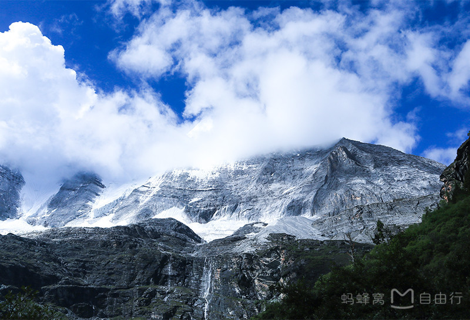
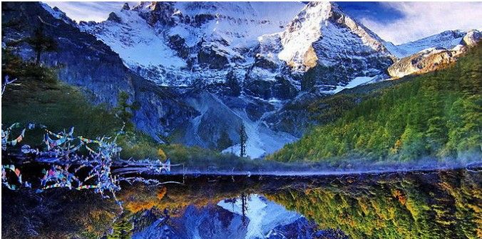
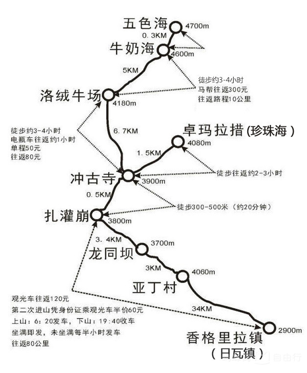
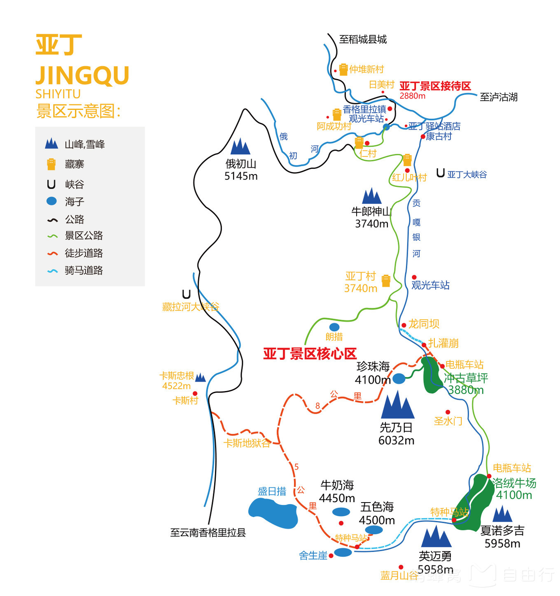
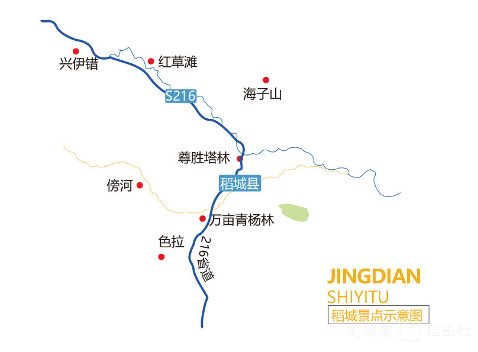
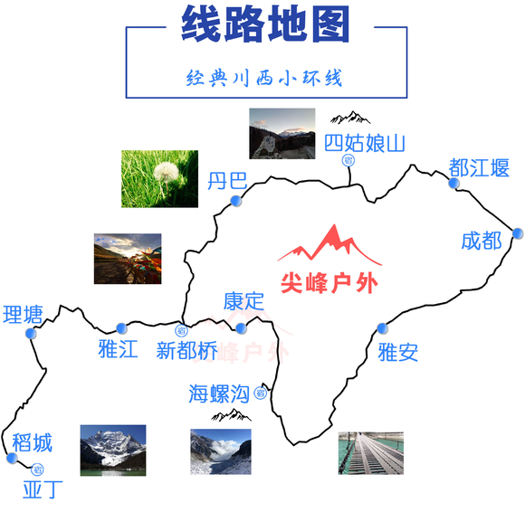

## 2017年川西之行

### 最佳季节

**4、5月和9、10月是去稻城亚丁的最佳时间**

* 6-8月是雨季，不易看到雪山。高原的天气是阴晴不定的，时而晴天，时而下雨。
* 11月到次年3月是冬季，路上有暗冰不安全，绝大多数酒店都会关门，而且冬天天气较冷，容易高反，加上稻城停水断电，很不方便。
* 4-5月稻城春季漫山杜鹃花开，神山积雪比秋天更多，显得更加壮观和明朗。  
* 9-10月秋季的稻城红黄相间，红草地与万亩金色杨树林让稻城五彩斑斓，雪山在蓝天白云的衬托下，更显梦幻。

	

### 物品
* 防晒霜 (可选)
* 登山杖，氧气瓶，高原反应药物 (采购必备)
* 巧克力，水，红牛，水果，其他干粮 (采购必备)
* 登山鞋/运动鞋，板鞋次之 (出行)
* 身份证，银行卡，现金，充电宝，雨伞，外套 (出行)

	

### 整体活动路线
* 上海/杭州—>武汉—>重庆—>成都—>四姑娘山—>稻城—>亚丁—>新都桥—>回程

### 主要的景点
* 稻城亚丁（天空之城）
* 新都桥（摄影天堂）
* 成都和重庆美食

### 酒店
1. 行程和人员定后在考虑

### 行程

#### 9月30日
1. 安排
	1. 出发:上海徐家汇附近出发
		* 180公里、两个半小时 	
	2. 途径:网易(杭州)网络有限公司
		* 接戴神、35公里、40分钟 
	3. 途径:阿里巴巴西溪园区
		* 接我、740公里、8小时
	4. 终点:武汉光谷广场
		* 休息
2. 注意:
	* 周博和涛哥多请假半天从上海出发,上海上车地点可以在商量，先按照徐家汇开始
	* 网易貌似比阿里离上海跟近点，先接戴神在接我
3. 小结
	* 午饭后周博和涛哥2点钟左右上车，预计5点钟左右到杭州。
	* 接我和戴神，6点钟左右出发去光谷，可以考虑在阿里吃个晚饭或者买东西车上吃，到时候看时间
	* 预计凌晨2-3点到光谷，入住酒店
	
#### 10月1日	
1. 安排
	1. 出发:光谷广场
		* 910公里、12小时
	2. 途径:未定
		* 吃晚饭并司机师傅缓解下疲劳
	3. 终点:重庆
2. 小结
	* 10点钟左右涛哥带我们去光谷广场逛逛，吃点小吃，司机继续休息
	* 2点钟左右出发去重庆
	* 预计凌晨2-3点到重庆，入住酒店

#### 10月2日
1. 安排
	1. 出发:重庆
		* 320公里、3小时50分钟
	2. 终点:成都
2. 小结
	* 上午11点钟左右去吃正宗重庆火锅
	* 下午1点钟左右出发去成都，下午5点钟到成都
	* 夜游成都，在成都浪啊浪
		
#### 10月3日	

1. 安排
	1. 出发:成都(480m)
		* 130km、1h:50m
	2. 途径:雅安(580m)
		* 140km、3h:40m
	2. 途径:泸定(1350m)(可以先去海螺沟)
		* 55km、1h:30m
	2. 途径:康定(2900m)
		* 76km、2h
	3. 终点:新都桥(3500m)
			
2. 游玩:
	* 大渡河、泸定桥、跑马山、沿途自然风光,慢慢适应海拔增高
3. 门票
	* 泸定桥门票10元/人
4. 小结
	* 总时间预计10个小时左右，停停走走看风景
	* 7点起床，吃早餐了出发，8点钟出发
	* 午餐路上解决
	* 新都桥晚饭和入住

#### 10月4号
1. 安排
	1. 出发:新都桥(3500m)
		* 200km、4h:30m
	2. 理塘县(4000m)
		* 150km、2h:30m
	2. 途径:稻城县(3000m)
		* 75km、1h:20m
	3. 终点:香格里拉镇(3000m)
2. 游玩
	* 卡子拉山、兔儿山、海子山、稻城白塔、青杨林、红草地
3. 小结
	1. 理塘县吃午饭
	2. 香格里拉镇晚饭和入住，亚丁附近，走到日瓦只要几分钟
	
#### 10月5号
1. 安排
	* 亚丁景区长线，避免留下遗憾
2. 路线
	* 日瓦—>扎灌崩—>冲古寺—>洛绒牛场—>夏诺多吉神山—>牛奶海—>央迈勇神山—>五色海—>仙乃日神山
2. 景区
	* 洛绒牛场能看到三座圣山
		1. 仙乃日，6005m
		2. 央迈勇，5821m
		3. 夏诺多吉，5724m
3. 门票
	* 景区观光车 120元/人 (必须)，亚丁景区门票2天有效
4. 注意
	* 早上早点出发,日瓦乘坐观光车约1小时到扎灌崩,再徒步15分钟就到冲古寺
	* 坐观光车进景区的时候建议坐在左边的位置，看风景角度极佳
	* 冲古寺到洛绒牛场6.7KM，徒步来回约3小时或乘坐景区电瓶车（往返80元/人，单程50元/人）约30分钟。建议乘坐电瓶车上山
3. 小结
	

#### 10月6号
1. 安排
	1. 亚丁景区短线
	2. 出发:香格里拉镇
		* 140km、3h:40m
	3. 终点:稻城县
		
2. 路线
	* 日瓦—>扎灌崩—>冲古寺—>冲古草坪—>珍珠海(藏语:卓玛拉措)
3. 景区
	* 珍珠海是看到仙乃日正面的最佳角度
4. 门票
	* 景区观光车，亚丁景区门票2天有效，可能需要出示前一天的同框照片就行，所以今天半价，60元/人(必须)
5. 注意
	* 冲古寺到珍珠海全程栈道，徒步比较容易
3. 小结
	1. 稻城县茹布查卡温泉
	
		
#### 10月7号

稻城-理塘-雅江-新都桥-塔公-丹巴-四姑娘山

1. 安排
	1. 出发:新都桥
		* 0公里
		* 0小时
	2. 途径:新都桥
	3. 终点:四姑娘山
	
#### 10月8号
四姑娘山-卧龙-都江堰-成都
#### 10月9号
重庆到武汉
	
#### 10月10日
武汉回杭州，上海

### 费用

1. 租车
	* 信息: 9天，别克GL8，7座，车价30w左右的车
	* 总费用:费用7.5k，按8k计算

2. 司机
	* 信息:8天，按照每天500，估计不够
	* 总费用:跟租车费用平铺，按费用4k
	
3. 油费和过路费
	* 信息:1963.1公里，接近2k公里，油费1300元不到，过路费1200元不到
	* 总费用:预计2500*2=5k(来回)

4. 住宿
	* 信息:8天，按照双人房200，三人房600计算
	* 总费用:200 \* 7 \*8 =11.2k

5. 吃饭和零食
	* 信息: 8天，不能放过美食，每人200计算
	* 总费用: 200 \* 7 \*8 =11.2k

6. 门票
	* 还没估算，规划景点了在算，按照每人500先算着
	* 总费用: 500*6 =3k
6. 人均
	* (8k+4k+5k+11.2k+11.2k+3k)/6= 7k
	
### 风景区
#### 稻城景点

傍河、色拉、万亩杨林、尊胜塔林、红草滩、海子山、兴伊措

	
#### 亚丁景点

冲古寺、洛绒牛场、牛奶海、五色海、珍珠海、三大神山（仙乃日峰、央迈勇峰、夏诺多吉峰）

#### 川西小环线

	
		
			
		
		
		
		
		
	

	
	
